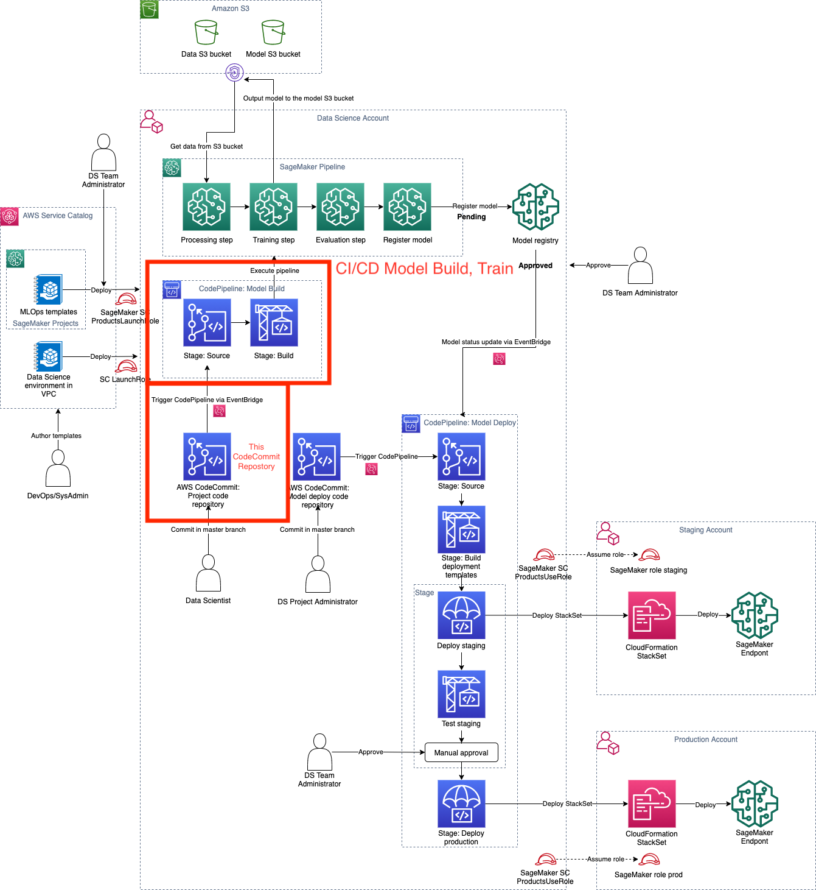

# Secure MLOps for SageMaker

The following diagram shows this CI/CD Model Build and Train pipeline in the context of the whole MLOps Data Science solution.



You own this seed code and you can modify this template to reflect your environment, MLOps guidelines, and project governance. You can also add additional tests for your custom validation to the CodePipeline project.

A description of some of the artifacts is provided below.

## Organization of the SageMaker model deploy seed code
The template provides a starting point for bringing your SageMaker Pipeline development to production.


```tree
.
├── CLI-PIPELINE-TRIGGER.md
├── CONTRIBUTING.md
├── LICENSE
├── README.md
├── buildspec-inference.yml
├── buildspec-train.yml
├── dataset
│   └── abalone-dataset.csv
├── img
│   ├── ml-ops-architecture-model-build-train.png
│   ├── pipeline-full.png
│   └── studio-pipeline-execution.png
├── ml_pipelines
│   ├── __init__.py
│   ├── __version__.py
│   ├── _utils.py
│   ├── get_pipeline_definition.py
│   ├── inference
│   │   ├── __init__.py
│   │   └── standard_model
│   │       ├── __init__.py
│   │       └── batch
│   │           ├── __init__.py
│   │           ├── pipeline.py
│   │           └── standard_model.py
│   ├── run_pipeline.py
│   ├── training
│   │   ├── __init__.py
│   │   ├── models
│   │   │   ├── __init__.py
│   │   │   └── standard_model.py
│   │   └── pipeline.py
│   └── utils
│       ├── __init__.py
│       ├── environment.py
│       └── model.py
├── requirements.txt
├── scripts
│   ├── create-model-package-group.sh
│   ├── create-update-pipeline.sh
│   ├── fetch-trigger-info.sh
│   ├── generate-and-register-inference-pipeline.sh
│   ├── get-pipeline-location.sh
│   ├── get-training-metadata.sh
│   └── start-pipeline.sh
├── setup.cfg
├── setup.py
├── source_scripts
│   ├── __init__.py
│   ├── evaluate
│   │   ├── __init__.py
│   │   └── evaluate.py
│   ├── postprocessing
│   │   ├── __init__.py
│   │   └── postprocess.py
│   └── preprocessing
│       ├── __init__.py
│       └── preprocess.py
├── tests
│   ├── test_inference_pipelines.py
│   ├── test_pipelines.py
│   └── test_preprocess.py
└── tox.ini

```


## Start here
This is a sample [CodeCommit](https://aws.amazon.com/codecommit/) repository that demonstrates how you can organize your code for an MLOps. This code repository is created as part of creating a Project in SageMaker and customized for your specific Data Science environment. This model build, train, and validate project uses your following Data Science environment settings:
- data science VPC, security groups and private subnets
- all communication is routed via private network via the configured VPC endpoints
- pre-configured Amazon S3 bucket for `data` and `models`. These bucket are encrypted and accessible only via S3 VPC endpoint

In this MLOps model build, train, and validate example, we are solving the abalone age prediction problem using the abalone dataset (see below for more on the dataset). The following section provides an overview of how the code is organized and what you need to modify. In particular, [`pipelines/abalone/pipelines.py`](ml_pipelines/training/pipeline.py) contains the core of the business logic for this problem. It has the code to use [SageMaker pipelines](https://aws.amazon.com/sagemaker/pipelines/) to create an automated ML pipeline to build, train, validate, and register the ML model. You will also find the code for that is used in the pipeline's preprocessing and evaluation steps in [`pipelines/abalone/preprocess.py`](source_scripts/preprocessing/preprocess.py) and [`pipelines/abalone/evaluate.py`](source_scripts/evaluate/evaluate.py) files respectively.

Once you understand the code structure described below, you can inspect the code and you can start customizing it for your own business case. This is only sample code, and you own this repository for your business use case. Please go ahead, modify the files, commit them and see the changes kicking off the SageMaker pipelines in the CI/CD system.

A description of some of the artifacts is provided below:
  
```
|-- buildspec-training.yml
|-- buildspec-inference.yml
```
  
Your [CodeBuild](https://aws.amazon.com/codebuild/) execution instructions. This file contains the instructions needed to kick off an execution of the Training and Inference SageMaker Pipelines in the CI/CD system (via [AWS CodePipeline](CodePipeline)). You will see that this file uses the environment variables for the Execution Role, Pipeline, ModelPackageGroup etc. The values for these environment variables is initially set by the deployment of this SageMaker project. You can customize them or add your own variables as required directly in CodePipeline pipeline.
  
```
|-- pipelines
|   |-- abalone
|   |   |-- evaluate.py
|   |   |-- __init__.py
|   |   |-- pipeline.py
|   |   `-- preprocess.py

```
  
The implementation of the pipeline steps, which includes:

+ a `pipeline.py` module defining the required `get_pipeline` method that returns an instance of a SageMaker pipeline
+ a preprocessing script `preprocess.py` that is used in feature engineering
+ a model evaluation script `evaluate.py` to measure the Mean Squared Error of the model that's trained by the pipeline
  
This is the core business logic, and if you want to create your own folder for your own business problem, you can do so, and implement the `get_pipeline` interface as illustrated here.
   
```
|-- pipelines
|   |-- get_pipeline_definition.py
|   |-- __init__.py
|   |-- run_pipeline.py
|   |-- _utils.py
|   `-- __version__.py
```
Utility modules for getting pipeline definition json (`_utils.py`) and running pipelines (`run_pipeline.py`). You do not typically need to modify these:


Python package artifacts:
```
|-- setup.cfg
|-- setup.py
```
  
A stubbed testing module for testing your pipeline as you develop:
```
|-- tests
|   `-- test_pipelines.py
```
  
The `tox` testing framework configuration:
```
`-- tox.ini
```

## Dataset for the Example Abalone Pipeline

The dataset used is the [UCI Machine Learning Abalone Dataset](https://archive.ics.uci.edu/ml/datasets/abalone) [1]. The aim for this task is to determine the age of an abalone (a kind of shellfish) from its physical measurements. At the core, it's a regression problem. 
    
The dataset contains several features - length (longest shell measurement), diameter (diameter perpendicular to length), height (height with meat in the shell), whole_weight (weight of whole abalone), shucked_weight (weight of meat), viscera_weight (gut weight after bleeding), shell_weight (weight after being dried), sex ('M', 'F', 'I' where 'I' is Infant), as well as rings (integer).

The number of rings turns out to be a good approximation for age (age is rings + 1.5). However, to obtain this number requires cutting the shell through the cone, staining the section, and counting the number of rings through a microscope -- a time-consuming task. However, the other physical measurements are easier to determine. We use the dataset to build a predictive model of the variable rings through these other physical measurements.

The dataset is delivered as part of the seed code repository and copied to your pre-configured Amazon S3 data bucket (as provisioned by the deployment of the data science environment). 

[1] Dua, D. and Graff, C. (2019). [UCI Machine Learning Repository](http://archive.ics.uci.edu/ml). Irvine, CA: University of California, School of Information and Computer Science.

## Security considerations for Amazon CodePipeline CI/CD and SageMaker pipelines

This MLOps project implements end-to-end security within the provisioned data science environment.
The specific security controls used by the project are the following:

- Secure network setup of SageMaker processing and training jobs [using network configuration parameters](https://sagemaker.readthedocs.io/en/stable/api/utility/network.html#sagemaker.network.NetworkConfig) of SageMaker API
- VPC endpoint setup for [CodeBuild](https://docs.aws.amazon.com/codebuild/), [CodePipeline](https://docs.aws.amazon.com/codepipeline/), [CodeCommit](https://docs.aws.amazon.com/codecommit/) for secure HTTPS communication without traversing public internet
- Running CodeBuild in the private VPC
- Access to Amazon S3 buckets `models` and `data` via the configured VPC endpoint only. All access is controlled via combination of the bucket and VPC endpoint policies
- S3 VPC endpoint policy which controls access to specified Amazon S3 buckets only
- Preventive controls to enforce usage of the secure network configuration in IAM for SageMaker execution role


## Monitoring and Alarms
If you have created cloudwatch alarms that you want to remove you can use the script `scripts/delete-cloudwatch-alarms.sh prefix dryrun_flag`